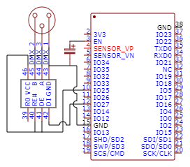

# ESP32-DMX-Control

A simple DMX controller made with an ESP32 and a MAX485 chip. The ESP32 is connected to the MAX485 via UART and the MAX485 is connected to the DMX bus. The ESP32 is connected to a WiFi network and can be controlled via a web interface.

## Hardware

-   ESP32-WROOM-32
-   MAX485 TTL to RS485 converter
-   (DMX512 3-pin XLR connector)
-   (10uF capasitor between EN and GND to boot the ESP32 without pressing the boot button)

## Software

The software is written in C++ and uses the Arduino framework. The ESP32 is programmed with PlatformIO.

## Web interface

The web interface is made with the ESPAsyncWebServer library. The web interface is served from the ESP32 and can be accessed via the IP address of the ESP32.
